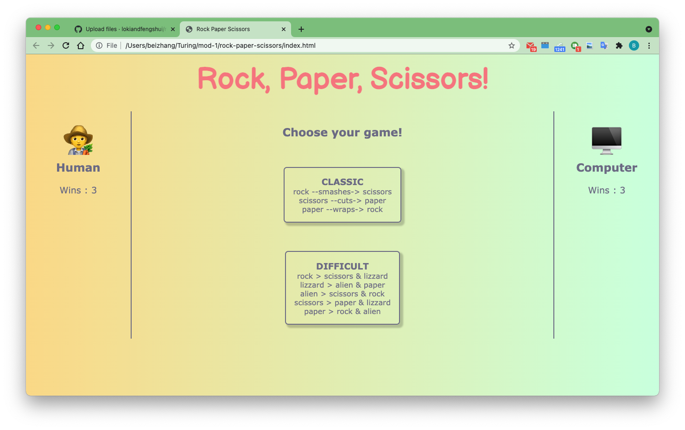

# Final solo project: Rock Paper Scissors

## Goal

- To build a small web game of "rock paper scissors" and its variant.
- To demonstrate what I have learned about HTML, CSS, Javascript, DOM manipulation, and class to class interaction.

## Running environment

- Clone down this repo.
- Open index.html in a browser

## Technology used

- HTML, CSS, Javascript

## Code architecture

- Entire app consists of one html page.
- Three JavaScript files:
  - `player.js` contains a `Player` class
  - `game.js` contains a `Game` class
  - `main.js` contains all DOM related scripts

## Chanllenges and wins

- Further understanding of the separation of data model and DOM manipulation
- Combining CSS layout options using both grid and flexbox
- The biggest challenges in this project are:
  - finding the right place in js file to place a timeout function
  - appending existing child to another location in html

## Acknowledgments

- Background color inspiration: [uiGradients](https://uigradients.com/#MegaTron)

## Author

Bei Zhang (owner of this repository)

## Screenshots

## Deployed page
[https://lokiandfengshui.github.io/rock-paper-scissors/](https://lokiandfengshui.github.io/rock-paper-scissors/)
